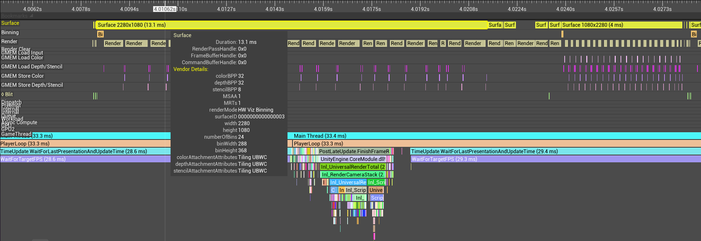
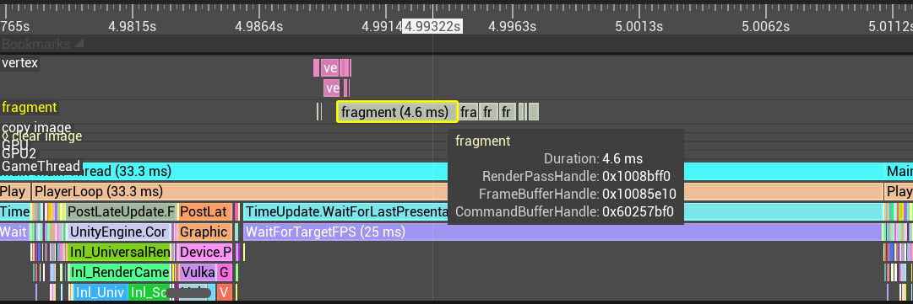
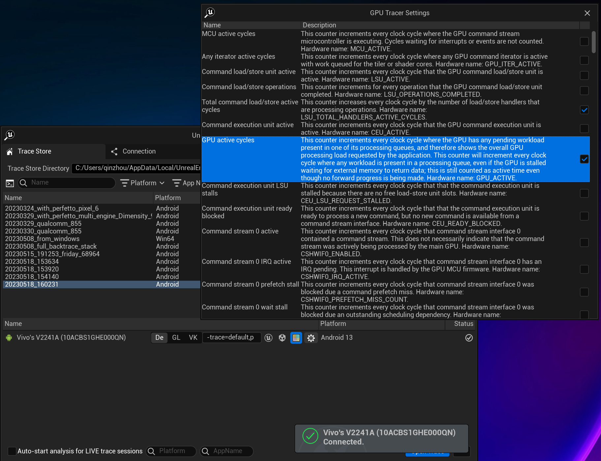
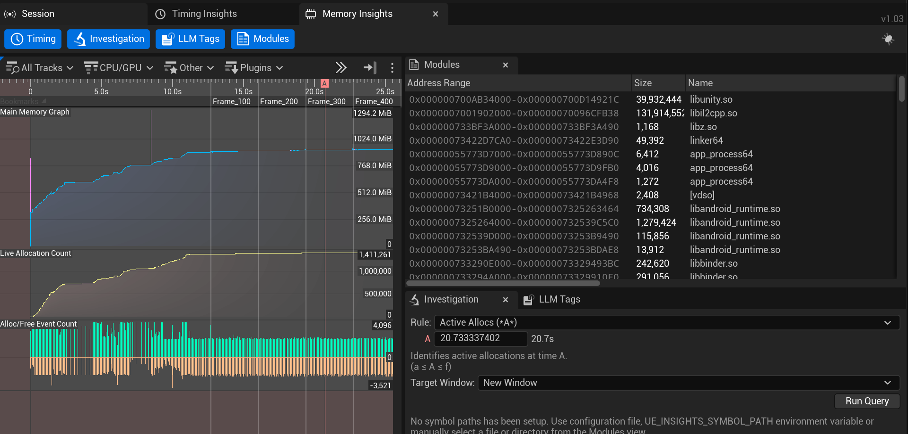
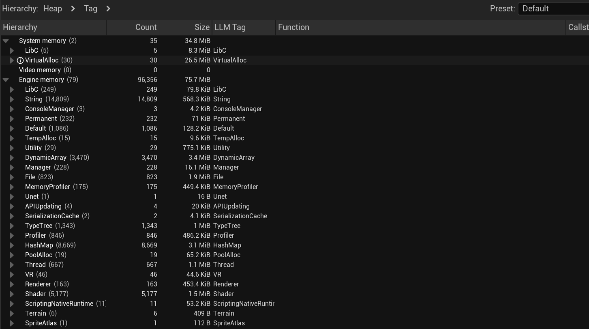
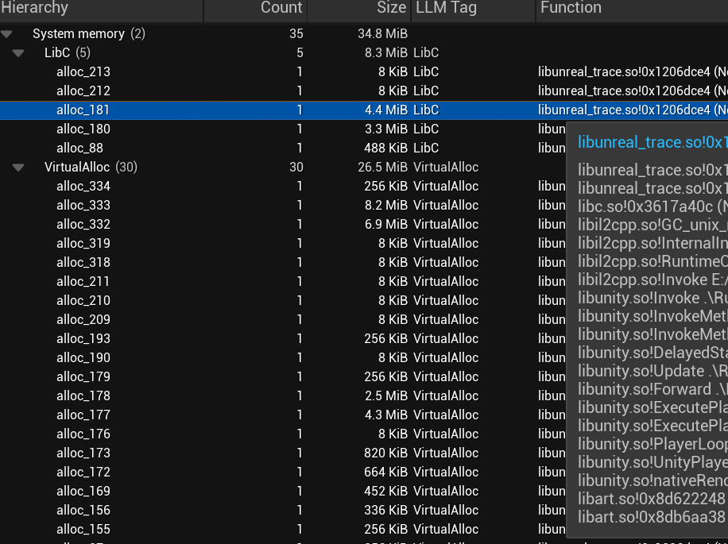

Standalone Unreal Trace Framework
===

Based on **Unreal Engine 5.1**.

You can integrate it to normal applications/game engines via C API on Windows, Android, Linux, iOS, macOS, etc. When the trace session is connected to Unreal Insights, you can view performance analysis result in the live trace.

## C APIs

```C
UTRACE_API void utrace_cpu_begin_name(const char* name, const char* file, int line);
UTRACE_API void utrace_cpu_begin_name2(const char* name, int name_len, const char* file_name, int file_name_len, int line);
UTRACE_API void utrace_cpu_end();
UTRACE_API void	utrace_emit_render_frame(int is_begin);
UTRACE_API void	utrace_emit_game_frame(int is_begin);
UTRACE_API int 	utrace_log_enabled();
UTRACE_API void	utrace_log_decl_category(const void* category, utrace_string name, utrace_log_type type);
UTRACE_API void	utrace_log_decl_spec(const void* logPoint, const void* category, utrace_log_type verbosity, utrace_string file, int line, const char* format);
UTRACE_API void	utrace_log_write_buffer(const void* logPoint, utrace_u16 encoded_arg_size, utrace_u8* encoded_arg_buffer);
UTRACE_API void utrace_file_begin_open(utrace_string path);
UTRACE_API void utrace_file_fail_open(utrace_string path);
UTRACE_API void utrace_file_begin_reopen(utrace_u64 oldHandle);
UTRACE_API void utrace_file_end_reopen(utrace_u64 newHandle);
UTRACE_API void utrace_file_end_open(utrace_u64 handle);
UTRACE_API void utrace_file_begin_close(utrace_u64 handle);
UTRACE_API void utrace_file_end_close(utrace_u64 handle);
UTRACE_API void utrace_file_fail_close(utrace_u64 handle);
UTRACE_API void utrace_file_begin_read(utrace_u64 readHandle, utrace_u64 fileHandle, utrace_u64 offset, utrace_u64 size);
UTRACE_API void utrace_file_end_read(utrace_u64 readHandle, utrace_u64 sizeRead);
UTRACE_API void utrace_file_begin_write(utrace_u64 writeHandle, utrace_u64 fileHandle, utrace_u64 offset, utrace_u64 size);
UTRACE_API void utrace_file_end_write(utrace_u64 writeHandle, utrace_u64 sizeWritten);
UTRACE_API utrace_u16 utrace_counter_init(utrace_string name, utrace_counter_type type, utrace_counter_display_hint hint);
UTRACE_API void utrace_counter_set_int(utrace_u16 counter_id, utrace_i64 value);
UTRACE_API void utrace_counter_set_float(utrace_u16 counter_id, double value);
UTRACE_API void utrace_mem_init();
UTRACE_API utrace_u32 utrace_mem_alloc(utrace_u64 address, utrace_u64 size, utrace_u32 alignment, utrace_u32 rootHeap);
UTRACE_API utrace_u32 utrace_mem_free(utrace_u64 address, utrace_u32 rootHeap);
UTRACE_API void utrace_mem_realloc_free(utrace_u64 address, utrace_u32 rootHeap);
UTRACE_API void utrace_mem_realloc_alloc(utrace_u64 address, utrace_u64 newSize, utrace_u32 alignment, utrace_u32 rootHeap);
UTRACE_API void utrace_mem_init_tags();
UTRACE_API int	utrace_mem_announce_custom_tag(int tag, int parentTag, utrace_string display);
UTRACE_API int	utrace_mem_name_tag(utrace_string tagName);
UTRACE_API int	utrace_mem_get_active_tag();
UTRACE_API void	utrace_mem_mark_object_name(void* address, utrace_string objName);
UTRACE_API utrace_u32 utrace_mem_heap_spec(utrace_u32 parentId, utrace_string name, utrace_u32 flags);
UTRACE_API utrace_u32 utrace_mem_root_heap_spec(utrace_string name, utrace_u32 flags);
UTRACE_API void utrace_mem_mark_alloc_as_heap(utrace_u64 addr, utrace_u32 heap, utrace_u32 flags);
UTRACE_API void utrace_mem_unmark_alloc_as_heap(utrace_u64 addr, utrace_u32 heap);
// Mmap or Virtual alloc
UTRACE_API void utrace_mem_trace_virtual_alloc(int traced);
UTRACE_API void utrace_mem_scope_ctor(void* ptr, utrace_string name, utrace_u8 active);
UTRACE_API void utrace_mem_scope_dtor(void* ptr);
UTRACE_API void utrace_mem_scope_ptr_ctor(void* ptr, void* addr);
UTRACE_API void utrace_mem_scope_ptr_dtor(void* ptr);
UTRACE_API void	utrace_module_init(utrace_string fmt, unsigned char shift);
UTRACE_API void	utrace_module_load(utrace_string name, utrace_u64 base, utrace_u32 size, const utrace_u8* imageIdData, utrace_u32 imageIdLen);
UTRACE_API void	utrace_module_unload(utrace_u64 base);
UTRACE_API void	utrace_vulkan_set_render_pass_name(utrace_u64 render_pass, utrace_string name);
UTRACE_API void	utrace_vulkan_set_frame_buffer_name(utrace_u64 frame_buffer, utrace_string name);
UTRACE_API void	utrace_vulkan_set_command_buffer_name(utrace_u64 command_buffer, utrace_string name);
UTRACE_API utrace_u32 utrace_current_callstack_id();
```

## Screenshots

* Android GPU Insights
    * GPU timeline
        

        
    * GPU counters
        
* Android Memory Insights
    * Modules (shared libraries)
    
    * Heaps
    
    * Stacks
    


----

## Third Party Libs

* [mimalloc (MIT)](https://github.com/microsoft/mimalloc)